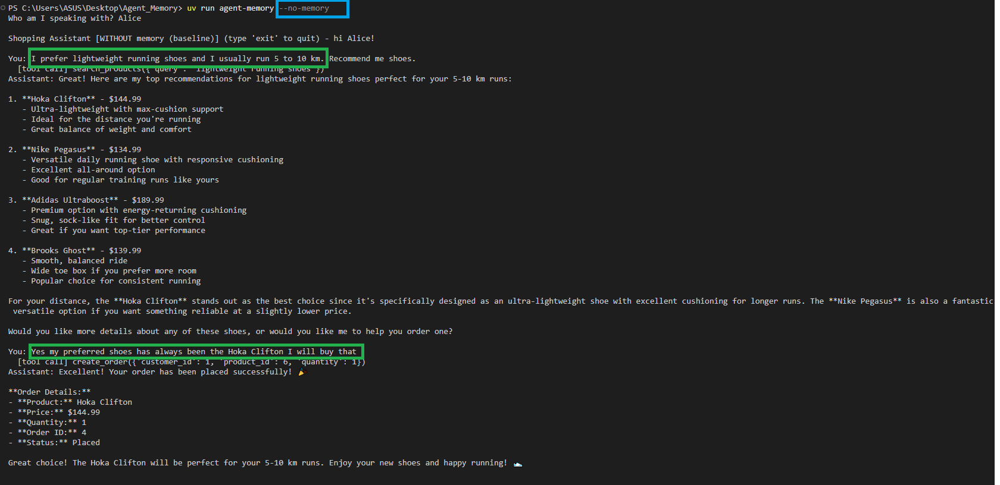
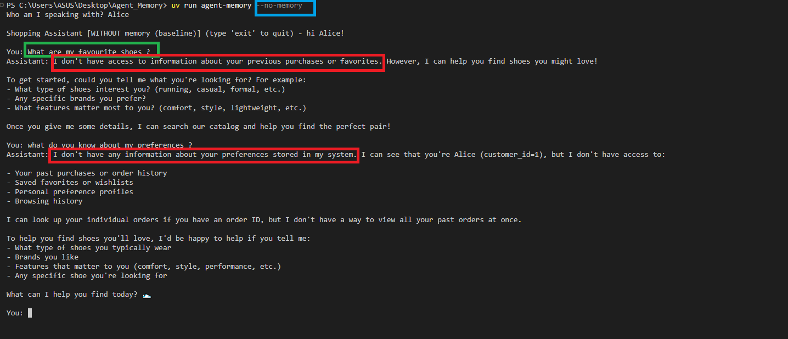
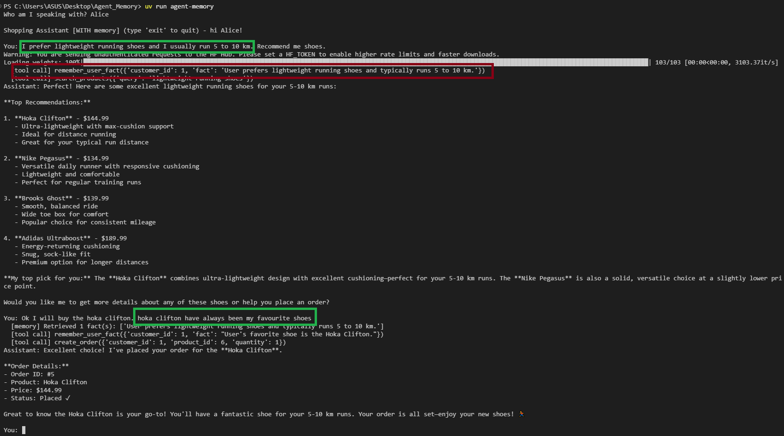
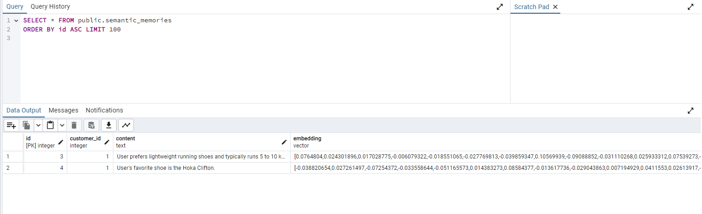
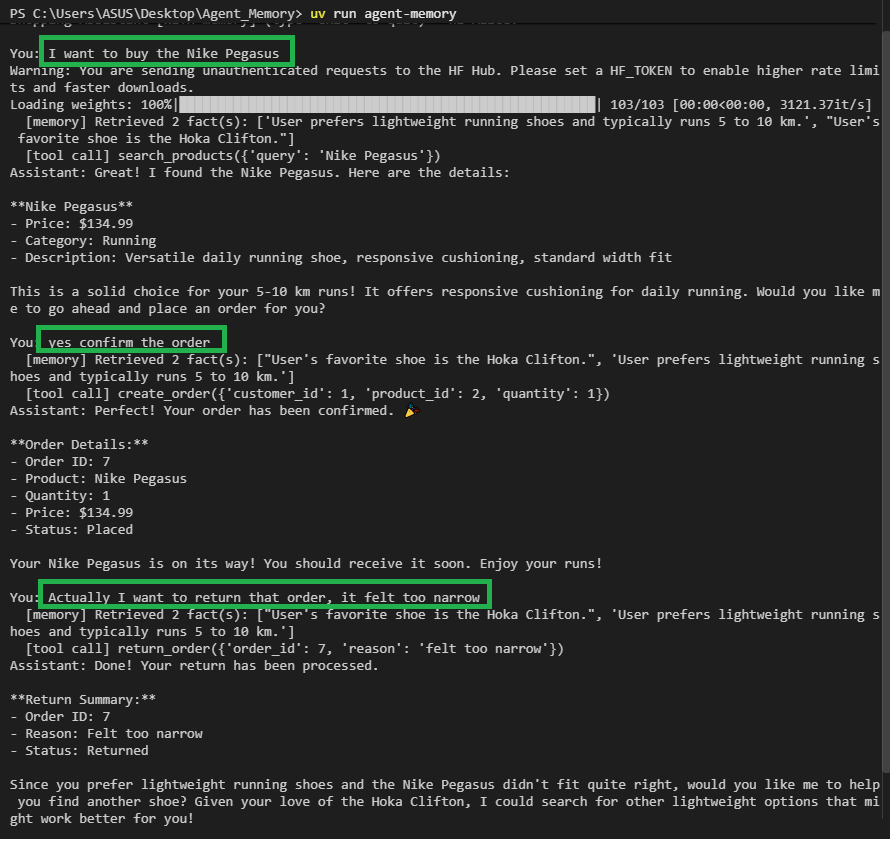
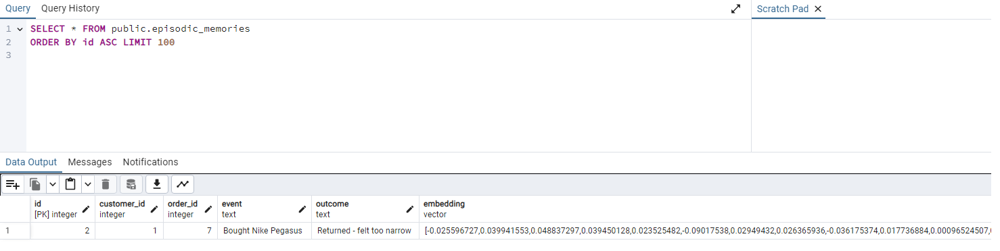
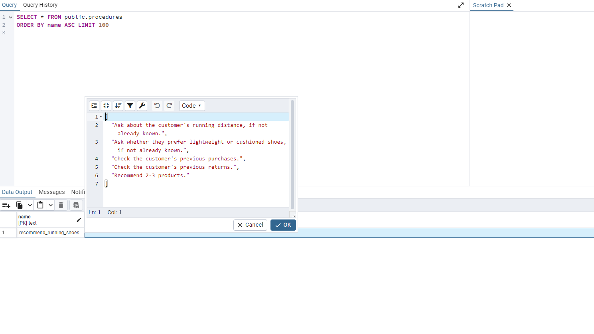

# Agent Memory


A small shopping assistant built to demonstrate, side by side, what memory actually adds to an LLM agent. The same agent, the same tools, the same model - run once with memory disabled and once with memory enabled - to make the difference observable rather than theoretical.

This is a learning project. The product (a tiny shoe store with products, customers, and orders) is deliberately minimal; the point is the agent harness and its memory system, not the e-commerce logic.

## The core question

A plain LLM call answers from the current conversation only. Close the session and everything is gone - preferences you stated, things that happened, lessons learned. This project builds an agent harness around a base LLM and adds three kinds of memory on top of it, then demonstrates the value of each one with a controlled before/after comparison: identical customer, identical question, only the memory system toggled.

```
                SIMPLE E-COMMERCE APP
                         |
                         v
                   AGENT HARNESS
                         |
              +----------+----------+
              v          v          v
           LLM API     Tools      Memory
                                     |
                        +------------+------------+
                        v            v             v
                    Semantic     Episodic      Procedural
```

## Architecture

- **LLM**: Claude (`claude-haiku-4-5`) via the Anthropic Messages API
- **Tools**: `search_products`, `get_product`, `create_order`, `get_order`, plus memory-specific tools described below
- **Database**: PostgreSQL with the `pgvector` extension, run via Docker Compose
- **Embeddings**: local, via `sentence-transformers` (`all-MiniLM-L6-v2`) - no external API, no cost, works offline
- **Interface**: a CLI (`uv run agent-memory`)

Tool calling follows the standard loop: the model is given tool names, descriptions, and JSON-schema parameters as part of its context, and it decides on its own - not a keyword match, not a rule engine - whether answering requires calling one before it can respond.

```
   user
    |
    v
   LLM  <---------------------+
    |                         |
    | decides a tool call     |
    | is needed                |
    v                         |
tool call (e.g.               |
search_products,              |
create_order,                 |
return_order, ...)             |
    |                         |
    v                         |
 harness executes it           |
 against Postgres              |
    |                         |
    v                         |
 tool result -----------------+
    |
    v (no more tool calls needed)
 response
```

This loop repeats until the model responds with text instead of another tool call - visible in the CLI output as one or more `[tool call] ...` lines before the final `Assistant: ...` line.

Two control patterns for memory are used deliberately, to make the mechanism visible rather than hidden inside a framework:

- **Harness-driven**: the harness decides, unconditionally, every turn - embed the message, run a similarity search, inject results into context. The model has no say in this. Used for retrieving semantic facts, episodic experiences, and the current procedure.
- **Model-driven**: the model decides, the same way it decides to call any other tool - by recognizing that a tool's description matches the situation. Used for saving a new semantic fact (`remember_user_fact`) and for revising a procedure (`update_procedure`).
- **Event-derived**: the harness derives a memory automatically as the side effect of a real action, without the model explicitly deciding "remember this." Used for episodic memory: when the model calls `return_order` to process a return, the harness writes the episode itself.

## Setup

Requirements: Python 3.11+, [uv](https://docs.astral.sh/uv/), Docker.

```bash
# start Postgres + pgvector
docker compose up -d

# install dependencies
uv sync

# configure environment
cp .env.example .env
# then edit .env and set ANTHROPIC_API_KEY
```

`.env` also sets `DATABASE_URL`, already pointed at the Docker Compose service (port 5433, to avoid clashing with a local Postgres install on 5432 - adjust if needed).

The database schema and seed data (customers, products, the default procedure) are created automatically on first run.

## Running it

```bash
# full agent, with all memory
uv run agent-memory

# baseline agent - no memory retrieval, no memory-writing tools
uv run agent-memory --no-memory
```

Both modes share the exact same product catalog, tools, model, and system prompt. `--no-memory` only removes the memory retrieval step and the three memory-writing tools (`remember_user_fact`, `return_order`, `update_procedure`) - it is a controlled baseline, not a different agent.

## Semantic memory

Semantic memory holds durable facts and preferences about a customer, independent of any specific event - the kind of thing that stays true across many conversations.

- **Writing**: model-driven. The agent has a `remember_user_fact` tool and decides on its own, the same way it decides to call any tool, when something the customer says is worth keeping.
- **Reading**: harness-driven. Before every message reaches the model, the harness embeds it, searches `semantic_memories` in pgvector for that customer's closest facts, and prepends them to the message as a `[Known facts about this customer]` block. The model never asks for this - it just appears in context.

**Without memory** - the agent is told the customer's running distance and favorite shoe, but the moment the session ends, that information is gone:





**With memory** - the same preferences are stated once:



...and correctly recalled in a brand new session, without the customer repeating anything:


The underlying `semantic_memories` table in Postgres, holding the embedded rows that made this possible:



## Episodic memory

Episodic memory holds specific past events and their outcomes, tied to real data (an order), rather than a generalized preference. "Prefers wider shoes" is a fact; "bought the Pegasus, returned it, it felt too narrow" is an episode - concrete, falsifiable, and far more persuasive when the agent brings it back up later.

- **Writing**: event-derived. There is no "remember this episode" tool. Instead, the agent has a `return_order` tool for processing an actual return. As a side effect of that real action, the harness automatically writes an episodic memory - the model only decided to process a return, not to save a memory.
- **Reading**: harness-driven, identical mechanism to semantic memory - embed the current message, search `episodic_memories` for that customer, inject the closest matches as a `[Past experiences with this customer]` block.

The customer buys a Nike Pegasus, then returns it because it felt too narrow:



**Without memory**, asked for running shoe recommendations afterward, the agent still suggests the Nike Pegasus again - it has no record the return ever happened:


**With memory**, the same request retrieves the episode and the agent avoids repeating the mistake, steering toward a wider-fitting alternative instead:


The underlying `episodic_memories` table, holding the order return that was recorded automatically:



## Procedural memory

Procedural memory holds a stored, step-by-step process for how the agent should carry out a task - not a fact about a customer, but an instruction about behavior. It is global rather than per-customer: one person's feedback about *how the agent should operate* changes it for everyone.

- **Writing**: model-driven, via an `update_procedure` tool, called when a customer's feedback implies the process itself should permanently change - not just this one answer.
- **Reading**: harness-driven. The current procedure is fetched fresh on every turn and injected as a `[Procedure to follow when recommending running shoes]` block, so a mid-conversation revision takes effect immediately.

The seeded procedure for recommending running shoes:

1. Ask about the customer's running distance, if not already known.
2. Ask whether they prefer lightweight or cushioned shoes, if not already known.
3. Check the customer's previous purchases.
4. Check the customer's previous returns.
5. Recommend 2-3 products.

The agent following those steps - asking before recommending, rather than guessing:


The `procedures` table in Postgres, holding the steps as they currently stand:



Note step 1 and step 2 are conditioned on "if not already known" - procedural memory is written to defer to semantic memory rather than operate in isolation. If a customer already has their distance and preference stored as facts, the procedure correctly skips asking again. The memory types compose; they are not siloed.

## Project structure

```
src/agent_memory/
  cli.py              interactive loop, memory injection, tool-call loop
  llm.py              Claude client, thin Chat/Response wrapper over the Messages API
  tools.py            tool declarations and dispatch (catalog, orders, memory-writing)
  memory.py           embedding, semantic + episodic read/write helpers
  db.py               schema, seed data, all SQL
docker-compose.yml     Postgres + pgvector
```

## What this project intentionally leaves out

There is no unified "end of conversation, decide what to remember across all three memory types at once" pass - each memory type here has its own explicit trigger (a tool call or a real event), which is more transparent for learning purposes even if less automatic than a single extraction step would be. There is no authentication, no payments, and no real e-commerce infrastructure - the product layer exists only to give the memory system something concrete to be useful about.
